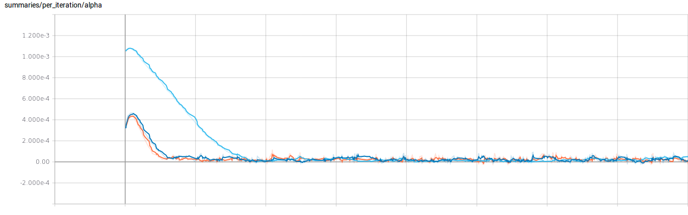

# HyperGradientDescent

This repo contains TensorFlow implementation of the Adam-HD algorithm discribed in the paper [**Online Learning Rate Adaptation with Hypergradient Descent**](https://arxiv.org/abs/1703.04782).

The implementation allows two regimes: one dimentional global learning rate (as was described in the paper and used in the original ADAM) and per-parameter vector of learning rates.

Also, we reproduced some results presented in the paper.

Here you see the results of training CNN on CIFAR-10 with batch size 128 near 100 epoch (50000 iterations) using ADAM algorithm with learning rates .

Here are the results for ADAM-HD algorithm with different iniutial learning rates  
The hyper learning rate  is fixed. The value is the same as was in the poaper.

We plot the evolution of learning rates during training. As wqas described in the paper. the learning rate increases during first stage of the training and then goes down to the .  

